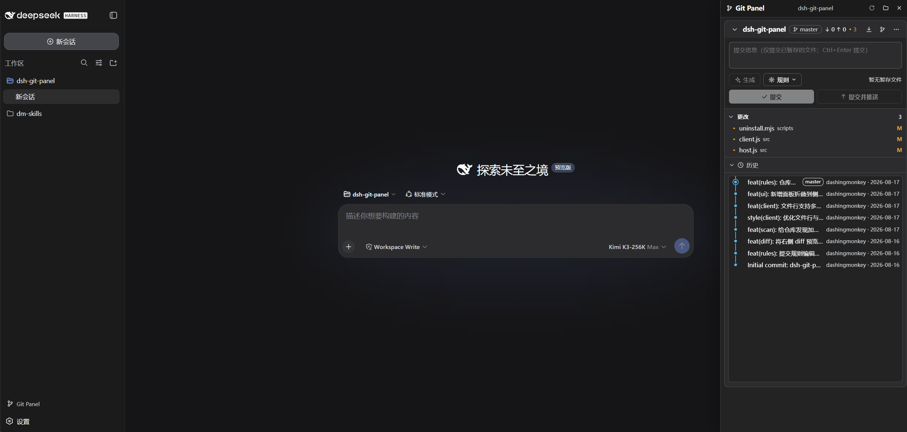
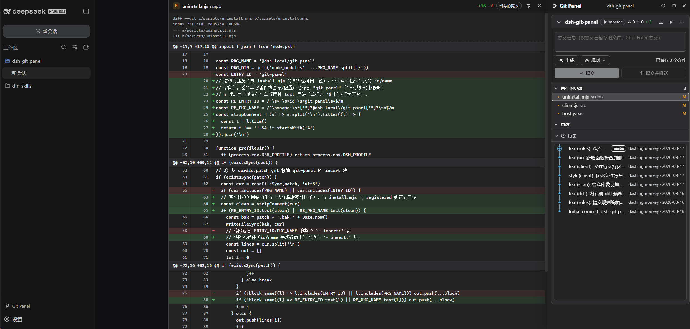
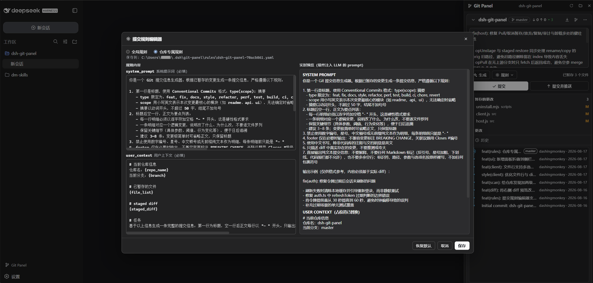

# dsh-git-panel — DSH Web 的 Git 工作区面板


> Git workspace panel for DSH Web: discover Git repositories under the current
> workspace, stage & commit like VS Code Source Control, and generate commit
> messages with LLM under configurable rules.

管理当前工作空间下的所有 Git 仓库，提供类 VS Code Source Control 的暂存/提交体验，并通过可配置的提交规则系统增强「AI 生成提交信息」能力。

- 自动发现当前工作空间下的 Git 仓库（含嵌套仓库与 worktree），切换工作空间自动重扫
- Staged / Changes / Untracked 分组，悬停文件行即暂存，点击文件名展开只读 diff
- LLM 按可配置规则生成 commit message（YAML 规则，全局 + 仓库级覆盖，修改即生效）
- Git 历史图谱（SVG lane 布局 + 无限滚动）、Pull / 分支 / 推送 / Stash / Reset / Clean
- 写操作带审计日志；中英双语 UI；零新增 npm 依赖

## 安装

前置要求：`npx @deepseek-ai/dsh web` 可运行；`git` 在 PATH 中；建议 Windows（Windows 专用探测在其他平台自动降级）。

### `dsh plugin`（推荐；需要 pnpm 在 PATH）

> 命令以 `npx @deepseek-ai/dsh` 形式给出，无需全局安装 dsh。

```sh
git clone https://github.com/DashingMonkey/dsh-git-panel.git
cd dsh-git-panel
npm run build                                # 本地目录安装需先构建
npx @deepseek-ai/dsh plugin --profile web add .
# 重启 dsh web，侧栏底部出现 Git Panel 按钮
```

卸载：`npx @deepseek-ai/dsh plugin --profile web remove @dsh-local/git-panel`。

### 一键脚本（无 pnpm 兜底）

```sh
./install.sh        # Windows 请用 Git Bash 或 WSL；等价于 node scripts/install.mjs
```

git 仓库 / tarball / 手动安装及迁移到另一台机器，见[安装详解](docs/install.md)。

## 使用

重启 dsh web 后，侧栏底部出现 Git Panel 按钮。面板自动跟随当前工作空间发现仓库；顶部提交区支持按生效规则生成 commit message（只填入不提交）。

面板总览：



Diff 窗口：



提交规则编辑器：



详细说明见[使用文档](docs/usage.md)；架构与源码结构见[架构文档](docs/architecture.md)。

## 与 VS Code 的差异

行为对齐 VS Code Source Control，仅以下不同：

- 只能整文件暂存，不支持分块暂存（hunk staging）
- 提交只针对已暂存文件；无暂存文件时提交按钮禁用，不会像 VS Code 那样自动提交全部更改
- push 不弹凭据输入，无凭据/需 SSH 口令时直接失败并提示

## 许可证

[MIT](LICENSE) © 2026 DashingMonkey
