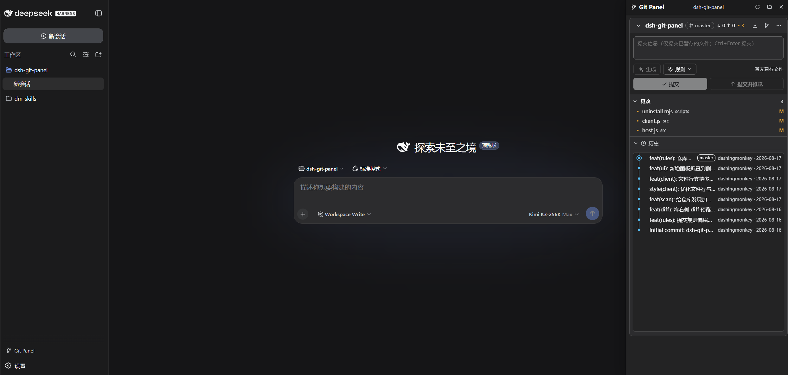
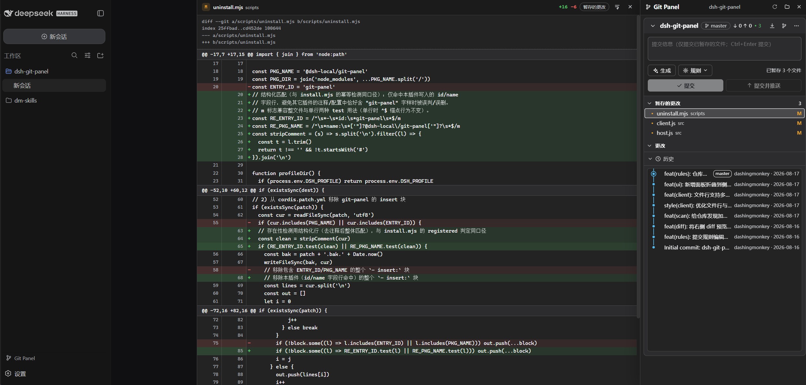
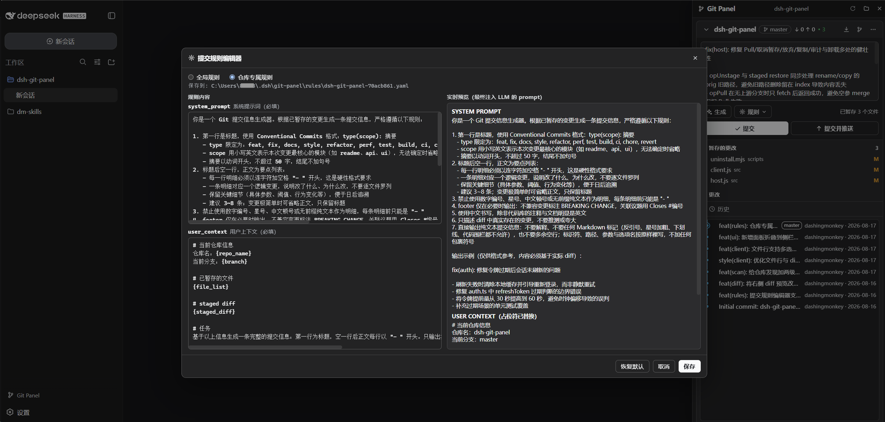

# dsh-git-panel — DSH 的 Git 工作区面板（Web / 桌面版通用）


> Git workspace panel for DSH (Web and Desktop): discover Git repositories under the
> current workspace, stage & commit like VS Code Source Control, and generate commit
> messages with LLM under configurable rules.

管理当前工作空间下的所有 Git 仓库，提供类 VS Code Source Control 的暂存/提交体验，并通过可配置的提交规则系统增强「AI 生成提交信息」能力。**同一份插件同时适配 `dsh web`（命令行版）与 DeepSeek Harness 桌面版**——两侧是各自独立的 profile，装到哪个由安装脚本的参数决定。

- 自动发现当前工作空间下的 Git 仓库（含嵌套仓库与 worktree），切换工作空间自动重扫
- 侧边栏（停靠挤压对话区，默认）/ 浮窗两种布局模式即时切换，宽度可拖拽并记忆
- Staged / Changes / Untracked 分组，悬停文件行即暂存，点击文件名展开只读 diff；合并冲突
  单独成组（顶部计数徽标 + 提示条），支持标记为已解决、完成合并、中止合并（rebase /
  cherry-pick 冲突同样成组，但收尾出口在终端，面板只给指引）
- diff 抽屉图片预览：png/jpg/gif/webp 等图片直读旧/新两版并排对比，点击任一图片全屏 1:1 原始尺寸查看（棋盘格透明底、超出屏幕可滚动、左右方向键切换新旧版本），标签显示像素与大小（单图上限 8MB）
- LLM 按可配置规则生成 commit message（YAML 规则，全局 + 仓库级覆盖，修改即生效）
- Git 历史图谱（SVG lane 布局 + 无限滚动；默认只画当前分支 + 上游的单线视图，可切「全部」看所有分支/标签）、Pull / 分支 / 推送 / Stash / Reset / Clean
- 写操作带审计日志；中英双语 UI；零新增 npm 依赖

## 安装

前置要求：`git` 在 PATH 中；建议 Windows（Windows 专用探测在其他平台自动降级）。
目标环境二选一（或都装，互不影响）：

| 目标 | profile | 说明 |
| --- | --- | --- |
| 命令行版 | `~/.dsh/profiles/web` | `npx @deepseek-ai/dsh web` 可运行 |
| 桌面版 | `~/.dsh/profiles/desktop` | 已安装并**至少启动过一次** DeepSeek Harness 桌面应用 |

### 一键脚本（推荐：自动选对 profile）

```sh
node scripts/install.mjs desktop   # 桌面版（先完全退出桌面应用）
node scripts/install.mjs web       # 命令行版（dsh web）
node scripts/install.mjs           # 只有一个 profile 时自动选中；两个都在会提示二选一
```

`./install.sh [web|desktop]` 与 `node scripts/install.mjs` 等价（Git Bash / WSL / macOS / Linux）。
卸载用 `node scripts/uninstall.mjs desktop`（或 `web`）。

> **为什么两个 profile 的安装方式不同？** 命令行版走「复制式」：构建产物直接复制进 profile 的
> `node_modules` 并在 `cordis.patch.yml` 注册插件行，不依赖 pnpm。桌面版的 profile 由 Electron
> 应用独占管理（DSH 明确拒绝 `dsh --profile desktop` 的普通启动与配置导出），只能用**桌面应用
> 自带的 CLI** 把本包登记为 `link:` 依赖——安装脚本会自动定位应用安装目录并调用它，你不需要
> 手敲那串长命令。

### `dsh plugin`（官方机制；需要 pnpm 在 PATH）

```sh
git clone https://github.com/DashingMonkey/dsh-git-panel.git
cd dsh-git-panel
npm run build                                # 本地目录安装需先构建
npx @deepseek-ai/dsh plugin --profile web add .
# 桌面版必须用桌面应用自带的 dsh（普通 dsh 会拒绝 desktop 这个保留 profile）：
& "<应用安装目录>\resources\runtime\cli\bin\dsh.cmd" plugin --profile desktop add .
```

卸载：`... plugin --profile <web|desktop> remove @dsh-local/git-panel`。

### 桌面版图形入口：侧栏 Plugins 页

桌面版自带插件管理页（侧栏 **Plugins**），「Add plugin」接受包名（可带版本）、Git 地址、
tarball 或**本地绝对路径**——填本仓库路径即可安装，内部走同一套组合包机制与自带 pnpm，
不需要终端。装完同样需要重启应用（或按提示重载）。

git 仓库 / tarball / 手动安装及迁移到另一台机器，见[安装详解](docs/install.md)。

## 使用

重启（桌面版需**完全退出**应用再打开）后，侧栏底部出现 Git Panel 按钮。面板自动跟随当前工作空间发现仓库；顶部提交区支持按生效规则生成 commit message（只填入不提交）。

面板总览：



Diff 窗口：



提交规则编辑器：



详细说明见[使用文档](docs/usage.md)；架构与源码结构见[架构文档](docs/architecture.md)。

## 许可证

[MIT](LICENSE) © 2026 DashingMonkey
